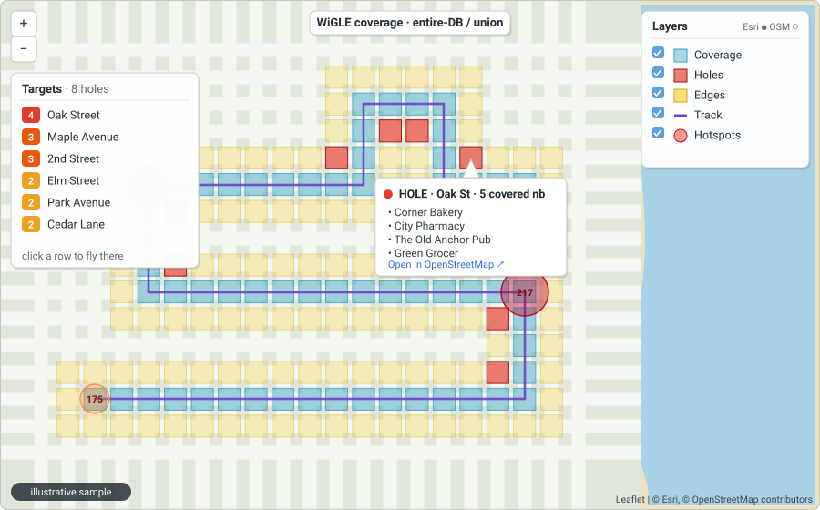
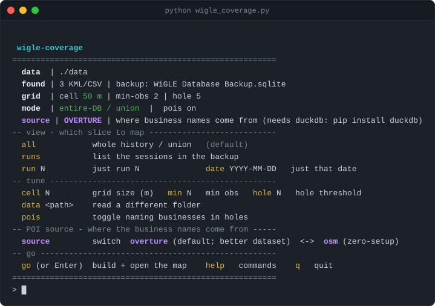

# WiGLE coverage

[](https://github.com/f34rinc/wigle-coverage/actions/workflows/ci.yml)
[](LICENSE)


Turn your WiGLE exports into a **coverage map** that shows where you've walked and
— more usefully — **recommends where you haven't**: the blank cells on the frontier
of your footprint (walk outward) and the holes inside it (streets you skipped). Built
for planning the next wardrive so each outing lands on ground that's new to you.

Output is a **self-contained local Leaflet map** (`.html`) you open in your browser.

<p align="center">
  
</p>

<p align="center"><sub><i>Illustrative sample — not real coverage data.</i></sub></p>

> *Independent hobby project — **not affiliated with, endorsed by, or connected to
> [WiGLE](https://wigle.net)**. "WiGLE" is a trademark of its owner, used here only to
> name the data this tool reads.*

## Quick start (no arguments)

Drop your WiGLE **`.sqlite` backup** (or KML/CSV exports) into the **`data/`** folder beside
the script, then run it with **no arguments** for an interactive menu:

```
python wigle_coverage.py
#  data   | ./data   (backup: WiGLE Database Backup.sqlite)
#  grid   | cell 50 m | min-obs 2 | hole 5 | hotspot auto
#  gaps   | run 30 min | track 5 min
#  mode   | entire-DB / union
#  pois   | on | 100 total, 4/hole
#  source | OVERTURE (where the business names come from; OSM fallback w/o duckdb)
#  > runs      list sessions   > run 3   map one walk    > cell 75      tune the grid
#  > hotspot 0  circles off     > max 50  fewer targets   > track x.gpx   add a path
#  > ??        full per-flag reference      > go          build + open the map
```

Out of the box you get **coverage + the holes/edges to fill next**, your walked **track**,
the **businesses named inside each hole** (a gap becomes a hit-list), one-tap **Pin /
Directions** links to walk to any target from your phone, and a **Hotspots** layer marking
your densest cells. `-i` / `--menu` forces the menu even with other flags;
`--data DIR` points at a different folder. Everything also works as one-shot CLI flags for
scripting (full list under [Command line](#use-it)).

## Best input: the WiGLE "Database Backup" (`.sqlite`)

**Export the entire database.** The `.sqlite` backup is the single best file to feed this
tool, because it carries everything in one place:

- **coverage** — every network's location (where you were),
- **your actual track path** — the timestamped GPS breadcrumb (a black line by default, recolorable in the map), and
- **timestamps** — which unlock the run views (`--list-runs`, `--run N`, `--date`).

A KML/CSV export has *none* of the track or timing — just network locations — so a backup
alone does more than a whole folder of KMLs. Drop one in `data/` (or pass it) and you get
coverage **and** path **and** run-slicing from that one file.

### How to export it from the WiGLE app (Android)

1. Open the **WiGLE WiFi Wardriving** app.
2. Go to the **Data** tab (where the KML/CSV export buttons are).
3. Tap **"Backup DB"** / **"Database Backup"** (button labels vary a little by version).
4. It writes a SQLite file to the phone — usually the `wiglewifi` folder. It often has
   **no file extension** (just `WiGLE Database Backup`), sometimes timestamped.
5. Copy that file to your PC and drop it in this tool's `data/` folder — **as-is**.

> **No need to add a `.sqlite` extension.** The tool detects a WiGLE backup by its
> contents (the `SQLite format 3` signature), not its name, so the raw export works
> whether you pass it directly, put it in `data/`, or point `--track` at it.

> It's a **point-in-time snapshot** and **per-phone** — take a fresh backup for your latest
> walks, and back up each phone separately if more than one person collects.

### No backup handy? Bulk-download your uploads as CSV (WiGLE-Vault)

If you can't make a fresh `.sqlite` backup — say your history is spread across months of
uploads, or it's on a phone you no longer have — you can pull **every CSV you've uploaded to
your WiGLE account** in one shot with the third-party
**[WiGLE-Vault](https://github.com/Ringmast4r/WiGLE-Vault)** tool. It authenticates with a
**read-only API token** (from <https://wigle.net/account>) and drops all your CSVs into a
`vault/` folder; point this tool at that folder — drop it in `data/`, or pass the path — and it
unions them for coverage like any other WiGLE CSV.

> **SQLite is still the best input, though.** WiGLE-Vault gives you **CSV only**, and a WiGLE
> CSV carries **network locations but no GPS track and no timestamps** — so you get the coverage
> map and the holes/edges, but **not your walked path** and **not the run views**
> (`--list-runs` / `--run` / `--date`). Reach for WiGLE-Vault when a `.sqlite` "Database Backup"
> isn't available; when one *is*, prefer it — a single backup delivers coverage **and** path
> **and** run-slicing (see above).

> *WiGLE-Vault is an independent third-party project, not affiliated with this tool or with
> WiGLE. You supply your own API token, and it downloads only your own data.*

## Use it

<p align="center">
  
</p>

**Terminal interface:** run it with **no arguments** — or add **`-i`** / **`--menu`** — to drop
into an interactive menu. It reads your `./data` folder, shows the current settings as a panel,
and lets you set things up by typing short commands: pick a **view** (`runs`, `run 3`,
`date 2026-09-15`); tune the **grid** (`cell 75`, `min 2`, `hole 5`, `hotspot 0`) and the
**run/track gaps** (`rungap`, `trackgap`); shape the **POI hit-list** (`pois`, `source`, `max`,
`perhole`, `refresh`); or point it at a **track / output file** (`track x.gpx`, `out map.html`) —
then **`go`** (or just Enter) to build and open the map. Each change clears and redraws the panel
so you always see the live state. **`help`** shows the compact command list, **`??`** (or `man`) a
full per-flag reference — **`help <cmd>`** the detail for just one — and **`q`** quits.

**Drag-and-drop (Windows):** drop one or more `.kml` / WiGLE `.csv` files — or the
whole `WiGLE data` folder — onto `wigle_coverage.py`. It unions everything, builds
the map, and opens it in your browser.

> Coverage is most meaningful from the **union of all your exports**, so dragging the
> whole folder is the sweet spot — it auto-uses the KMLs for coverage and the **newest
> `.sqlite` backup for the track**. A single run-KML just maps that one run's footprint.
> A `.sqlite` backup on its own (dropped or passed) drives **both** coverage and path.

**Command line:**

```
python wigle_coverage.py "C:\path\to\WiGLE data" --cell-size 50 --min-obs 2 --out map.html
```

The full flag list (grouped as `python wigle_coverage.py --help` prints them):

**Input — what to read**

| flag | meaning |
|---|---|
| `paths …` | KML/CSV, a `.sqlite` backup, a folder, or globs; empty = the `./data` folder |
| `--track` / `--backup` / `--db BACKUP` | a WiGLE `.sqlite` backup **or a `.gpx`** — adds your path (a `.gpx` alone maps just the track); the `.sqlite` also powers the run views |
| `--data DIR` | folder to read when no path is given (default: `./data`) |

**Views — which slice to map**

| flag | default | meaning |
|---|--:|---|
| `--list-runs` | – | list the backup's sessions, then exit |
| `--run N` | – | map only run *N* (see `--list-runs`) |
| `--date YYYY-MM-DD` | – | map only that local date |
| `--run-gap MIN` | 30 | gap separating one run from the next |
| `--pois` / `--no-pois` | on | name the businesses in each hole |
| `--poi-source SRC` | `overture` | `overture` (needs `pip install duckdb`; auto-falls back to `osm` without it), or `osm` (no setup) |
| `--overture-confidence C` | 0.5 | Overture: min confidence, 0–1 |
| `--overture-release D` | pinned | Overture: which release (`YYYY-MM-DD.N`) the local snapshot uses |
| `--max-pois-per-hole N` | 4 | max shown per hole; rest → "+N more" (0 = off) |
| `--max-pois N` | 100 | max total, richest holes first (0 = off) |
| `--refresh-pois` | off | ignore the result cache; re-query the source |
| `--refresh-overture` | off | re-download the local Overture snapshot (pull the latest release) |

**Grid + track tuning**

| flag | default | meaning |
|---|--:|---|
| `--cell-size M` | 50 | grid cell edge, metres (~half a block; below ~25 m just maps GPS scatter) |
| `--min-obs N` | 2 | networks in a cell before it counts as "covered" (filters stray fixes) |
| `--hole-threshold N` | 5 | covered neighbours (of 8) for a "hole" vs an "edge" |
| `--hotspot N` | adaptive | circles on cells with ≥ N networks (default: top 10%; 0 = off) |
| `--track-gap MIN` | 5 | minutes between GPS fixes that starts a new path segment |

**Interface + output**

| flag | default | meaning |
|---|--:|---|
| `-i` / `--menu` | – | interactive menu instead of flags |
| `--out FILE` | *beside input* | output HTML path |
| `--no-open` | off | don't auto-open the map |
| `-h` / `--help` | – | print this whole list |

## How it reads the map

**Teal** cells are **covered** — a cell holds at least `--min-obs` networks (default 2), proof
you passed through it. Each *uncovered* cell that touches coverage is then split by **how many of
its 8 neighbours (sides + corners) are covered** — the cutoff is `--hole-threshold` (default 5).

`■` = covered neighbour · `□` = uncovered · the **center** square is the cell being classified:

| Its neighbourhood | Covered | Verdict |
|:---:|:---:|:---|
| `□ □ □`<br>`■ □ □`<br>`■ □ □` | **1–4** | 🟧 **edge** (frontier) — only *touches* your coverage; the outer boundary, walk outward |
| `■ ■ ■`<br>`■ □ ■`<br>`■ ■ □` | **≥ 5** | 🟥 **hole** / *skipped* — *ringed* by coverage; a street you walked around but not through |
| `□ □ □`<br>`□ □ □`<br>`□ □ □` | **0** | *(ignored)* — not next to any coverage, so it's never suggested |

Raise `--hole-threshold` → stricter, so fewer cells count as holes (more become edges); lower it
→ more holes. Each cell's map popup shows its exact covered-neighbour count.

**Hotspots.** A toggle-able **"Hotspots (networks)"** layer marks your densest cells with
WiGLE-style circles — sized by how many **distinct networks** were captured there (counted once per BSSID, so an AP that shows up in several unioned exports doesn't inflate the count), with the count
labeled on each (click for the exact number). It counts *actual APs* — from the KML/CSV
directly, or from the SQLite backup's `network` table (not the GPS track). In a `--run` / `--date` view it instead counts the distinct networks *observed on that walk* (from the backup's `location` table, within the run's time window), so the hotspots match that run's coverage rather than your whole history — the two views' numbers won't line up 1:1, which is expected. By default it
shows your **top ~10% densest cells** (adaptive per dataset); `--hotspot N` sets an absolute
threshold (only cells with ≥ N networks), and `--hotspot 0` turns it off.

**Your actual path.** Pass `--track "C:\...\WiGLE Database Backup.sqlite"` and the map
gains a toggle-able **line of where you really walked** (**black by default**, recolorable
live via the in-map **"Track color"** picker — Blue, Cyan, Green, Purple, …) — raw GPS fixes
from the backup's `location` table, split into segments on time gaps (so separate walks don't
join with a straight line). Cells come from the KML/CSV; the track from the SQLite.
Lay it over the cells to see exactly which streets your coverage came from. A
bottom-left dropdown recolors the track line.

**Just a GPX?** `--track` also accepts a **`.gpx`** (a GPS-watch / logger / route export).
Handed in *alone* — no KML/CSV/SQLite — it renders a **track-only map**: just your path over
the basemap, view fit to the route (no coverage cells, since a GPX carries GPS points but no
networks). Each `<trkseg>` / `<rte>` becomes its own segment. Pass coverage data too and the
GPX simply supplies the path in place of a SQLite backup.

**Historical runs vs a single run.** Because the SQLite backup carries timestamps
(a KML doesn't), you can slice it by session:

```
python wigle_coverage.py --track "...\WiGLE Database Backup.sqlite" --list-runs
#   [  1] 2026-09-06  18:42-20:15   93m    4,120 fixes
#   [  2] 2026-09-13  16:02-17:48  106m    6,800 fixes
python wigle_coverage.py --track "...\WiGLE Database Backup.sqlite" --run 2
python wigle_coverage.py --track "...\WiGLE Database Backup.sqlite" --date 2026-09-13
```

With just `--track` and no run flag you get the **entire-DB view** — all your history
at once (coverage *and* path straight from the backup, no KML needed).

Each cell's popup gives its center coordinate plus an **Open in OpenStreetMap** link,
so one click drops you at that exact spot with full business/place names (the base
tiles don't carry those). Every **hole/edge** popup and every **Targets-panel** row
also gets two **navigate buttons** — **📍 Pin** (opens the target in your phone's
default maps app) and **🧭 Directions** (a walking route from where you are, so you
can eyeball "it's ~2 blocks NE" instantly). These hand off to your maps app, so they
need no location permission, no server, and no special setup — they work however you
open the map, on the phone or desktop. The top-right switcher offers Streets, Light gray,
Satellite, and **Satellite + labels** — the last is handy for orienting among
look-alike highrise blocks.

### Optional: a nicer OSM basemap (bring your own key)

The keyless Esri basemaps work out of the box. If you want a clean OSM-based
"Alidade Smooth" style too, drop your **own** free API key into a `map_key.txt`:

1. Grab a free key at <https://client.stadiamaps.com/> (email, no card).
2. Copy `map_key.txt.example` → `map_key.txt` and paste your key on a line.

An **"OSM smooth (Stadia)"** option then appears in the layer switcher (and becomes the
default). **No key → the option simply isn't shown.**

### Self-contained map (no CDN)

Leaflet is **vendored and inlined** into every generated `.html` (`vendor/leaflet/`, BSD-2-Clause,
verified against its published hash), so the map has **no CDN dependency** — it loads in a
hardened browser that blocks remote scripts (NoScript / strict tracking-protection), and the app
itself works offline. Only the **basemap tiles** (Esri, or Stadia) are fetched at view time, so
with no connection you'll see your grid, holes, targets and track on a blank background rather
than streets. Refresh the bundled Leaflet with `python scripts/vendor_leaflet.py`.

### Target the holes: name the businesses (POIs)

**On by default:** every run looks up what named businesses sit inside each *hole* — turning
"empty cell here" into a concrete hit-list for your next run. The source is **Overture Maps** by
default (with an automatic **OpenStreetMap** fallback when DuckDB isn't installed — see
[Default source](#default-source-overture-maps-with-a-zero-setup-osm-fallback) below). Pass
**`--no-pois`** to skip the lookup (or toggle `pois` in the menu).

```
python wigle_coverage.py
#   > HOLE @ 40.700, -73.990  (4 targets): Corner Bakery · City Pharmacy · The Old Anchor Pub · Green Grocer
```

You get the same list **four ways**, so you can plan at the desk and work off it in the field:

- in each hole's **map popup**;
- in an in-map **"Targets" panel** (top-left), most-loaded holes first — **click a row** to fly
  the map to that hole and open its popup; **click a hole cell on the map** to re-sort the panel
  *nearest-first from that cell* (a toggle up top turns this on/off), handy for planning the hop
  to the next-closest gap; and **check a target off** (✓) to hide it as you cover ground — the
  **reset** button (↺) brings everything back (it's a temporary in-session planning overlay, not
  saved to disk);
- in a standalone **`*_targets.html`** — a self-contained, **offline, printable field sheet**.
  It **groups holes by postcode** (then by neighborhood where a postcode isn't mapped, then a
  catch-all "unlocated"), labels each hole by its **street**, and lists every business with its
  **street address** — with a checkbox to tick off as you go. The panel links straight to it, or
  open it on your phone. No network needed once saved;
- in a plain **`*_targets.txt`** (same grouping + addresses) for grepping/scripting.

> **Addresses come from the POI source and coverage varies worldwide** — Overture tends to be
> cleaner and denser; OSM (the fallback) is strong in much of Europe/North America, thinner
> elsewhere. When a business has no address the sheet falls back gracefully (the coordinate still
> powers the map link), and postcode-less holes drop to the neighborhood or "unlocated" section.
> Addresses ride along in the *same* query — **no extra requests** to the source.

**Kept manageable.** The list is trimmed so it stays useful, not overwhelming:

| flag | default | meaning |
|---|--:|---|
| `--max-pois-per-hole` | 4 | most businesses shown per hole; extras collapse to a **"+N more"** note |
| `--max-pois` | 100 | total across all holes — keeps the **richest holes whole**, drops the sparsest past the budget |

Set either to `0` to lift that cap.

### Default source: Overture Maps (with a zero-setup OSM fallback)

Business names come from **[Overture Maps](https://overturemaps.org/) places** by default — an
open dataset (CDLA-Permissive 2.0) that blends Meta + Microsoft + OSM data, so it's *far* denser
on actual businesses, worldwide, with clean addresses and postcodes — and, unlike Overpass, it
reads from a stable cloud file instead of a live server that can be overloaded or rate-limited.

```
pip install duckdb                                  # one ~10 MB package, no other deps
python wigle_coverage.py <exports>                  # Overture is the default
```

That's the whole setup. On the **first run** the tool downloads the Overture places for your
**coverage area** just once (DuckDB reads Overture's cloud
Parquet, pruned to your bounding box) into a small **local snapshot** at `data/overture/` — from
then on **every lookup is offline** (no cloud, no rate limits, instant; a metro is tens of MB). It
re-downloads only when you wardrive **outside** the stored box (it auto-expands), or when you run
**`--refresh-overture`** to pull the latest release (`--overture-release` picks a specific one).
`--overture-confidence C` drops low-confidence places (default `0.5`). In a real dense-city run this
pulled **497 businesses into 96 holes in ~13 s**, versus 71 across 36 holes from OSM.

**Don't have DuckDB? Nothing breaks.** With no `duckdb` installed the tool prints a one-line
note and **auto-falls back to OpenStreetMap** for the run — so it still works out of the box with
zero setup; installing DuckDB just unlocks the richer default. Force OSM any time with
`--poi-source osm` (or toggle `source` in the menu). POIs are © Overture Maps Foundation (which
includes © OpenStreetMap, ODbL); the outputs carry the right attribution automatically.

**Gentle to OpenStreetMap.** When the OSM fallback is in play (no DuckDB, or `--poi-source osm`),
the lookup is careful with the volunteer-run Overpass servers. Instead of one big citywide
bounding box (which the Overpass server will time out with a `504` on a large entire-DB view),
the lookup walks the area **one small
~1 km tile at a time, only over tiles that actually contain a hole** — each tile **cached
locally** (`./.poi_cache/`, ~30 days, git-ignored) and **politely paced**. So re-running over the
same ground (tweaking `--cell-size`, `--min-obs`, …) doesn't re-query OSM at all, and a hiccup on
one tile yields a **partial** list rather than wiping it (failed tiles aren't cached — re-run to
fill them in). Pass **`--refresh-pois`** to force a fresh pull.

Queries go to **`overpass.private.coffee`** first — a well-resourced instance (4 servers, 20
cores / 256 GB each) that states **"no rate limit in place,"** run for the community. (It's the
same server formerly known as `kumi.systems`, listed here under its current name.) The fallback
is **`overpass-api.de`**, the FOSSGIS reference instance — it works, but the OSM wiki flags it as
overloaded and asks you to *use alternatives if possible*, so we keep it only as a last resort and
pace it slowly. Both are equally up to date. A few things keep a bad Overpass day from becoming a
15-minute crawl:

- a **short per-tile timeout**, so a slow/dead tile bails in seconds instead of ~40s;
- **polite backoff-and-retry** — if a mirror answers *busy*, we wait and retry the **same** mirror
  before giving up: a kind, **randomized 35–60 s pause** on an explicit rate limit (`429`/`406` — over the courtesy the
  [OSM wiki](https://wiki.openstreetmap.org/wiki/Overpass_API) asks for, or the server's
  `Retry-After` if longer), and a shorter exponential backoff on a `50x` server error — so a merely
  *throttled* Overpass day completes instead of collapsing;
- a **circuit breaker** — if a mirror still fails **two tiles in a row** (a timeout or a dead
  connection, i.e. genuinely down — not a *busy* reply), it's dropped for the rest of the run; the
  other mirror carries on;
- **per-mirror pacing** — the overloaded reference instance is paced more slowly than the primary.

POIs are © OpenStreetMap contributors (ODbL); treat the result as a "known targets" list, not an
exhaustive one.

## Give back: donate to OSM and the servers we lean on

This tool is free because it stands on volunteer- and community-funded infrastructure. If it's
useful to you, please consider chipping in to the projects that make it possible:

- **OpenStreetMap** — the map data behind *everything* here (the basemaps, the businesses, the
  addresses). Donate to the OpenStreetMap Foundation at
  <https://supporting.openstreetmap.org/donate/> (or via
  [OpenStreetMap Germany](https://www.openstreetmap.de/spenden/)).
- **Overture Maps** — the default POI source (the business names in your holes). It's a
  Linux Foundation project **funded by member organizations**, so membership is org-level
  (companies pay tiered dues; qualified non-profits and government bodies may be exempt) — see
  [become a member](https://overturemaps.org/become-a-member/). There's **no individual donation
  button**, so as a solo mapper the way to give back is to **improve OpenStreetMap** (Overture's
  places build heavily on OSM, so your edits flow right back), contribute to their open schema and
  tools on [GitHub](https://github.com/OvertureMaps), or send open data / feedback to
  `info@overturemaps.org`.
- **Overpass API** — the query service that names the businesses in your holes (the OSM fallback
  source). The software is free and open (AGPL, by Roland Olbricht). Its reference instance
  `overpass-api.de` — which this tool uses only as a **last-resort fallback** — is operated by the
  non-profit **FOSSGIS e.V.**; donate at <https://www.fossgis.de/verein/spenden/> (German page;
  PayPal or bank transfer).
- **private.coffee** — the well-resourced, no-rate-limit Overpass mirror this tool queries
  **first** (formerly `kumi.systems`), run *free for the community* by
  [Private.coffee](https://private.coffee/). They don't solicit public donations — the courtesy
  they ask is a heads-up before any large-scale use, and a thank-you.
- **Esri** — the default **basemap tiles** (the satellite / street imagery under your coverage)
  come from Esri's keyless ArcGIS Online basemaps. Esri is a **commercial company**, so there's
  **no donation** — the way to respect it is to keep the **"© Esri" attribution** the map already
  shows (required by [Esri's attribution terms](https://developers.arcgis.com/documentation/esri-and-data-attribution/))
  and stay within their [terms of use](https://www.esri.com/content/dam/arcgisonline/docs/tou_summary.pdf).
  Organizations can also contribute local data through **Esri's Community Maps Program** (part of
  ArcGIS Living Atlas) to improve those basemaps.

Not into giving money? **Mapping the businesses in your own "holes" back into OpenStreetMap is a
donation too** — you're already standing in front of the unmapped ones, and it makes the next
person's target list better, anywhere in the world.

## Privacy

This tool runs **entirely on your machine** — nothing it reads or generates is uploaded or
published. Your WiGLE exports and the maps it builds carry **real GPS coordinates**, so the
bundled `.gitignore` keeps GPS-bearing files (`*.kml`, `*.csv`, `*.html`, `data/`, `out/`) out
of git: if you fork or commit, your coordinates won't land in a repo by accident. It's the same
rule that keeps the maintainer's own coordinates out of this public repo.

## What it is / isn't

- **Is:** a fast coverage + gap **planner** — it answers *"where haven't I mapped yet, and where
  should I wardrive next?"* Runs on the Python **standard library alone** (no required
  dependencies); **`duckdb` is optional but recommended**, since it unlocks the richer
  **Overture** POI dataset (without it, business lookups fall back to OpenStreetMap). It bins the
  AP locations in your exports into cells as a proxy for where you passed.
- **Isn't a network locator.** It deliberately does **not** plot your individual
  captured SSIDs on the map — that's not the point. This tool is about **coverage and
  planning the next wardrive**, not looking up where a specific network lives. To find a
  given network's location, use **[WiGLE](https://wigle.net)** itself. (The counts and
  the hotspot circles are *aggregate per-cell* totals; the hole popups name nearby
  *businesses* to target — never your own SSIDs.)

## Tests

```
python -m unittest discover -s tests -v
```

Stdlib only. Grid conversion, cell binning, coverage counting, and hole/edge
classification are covered with fabricated coordinates.

## License

**[GPL-3.0-or-later](LICENSE).** Free to use, study, share, and modify — but
derivative works you distribute must stay open under the same license. See the
[LICENSE](LICENSE) file for the full text.
